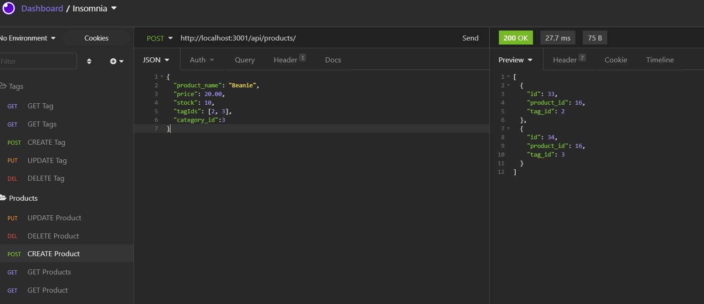
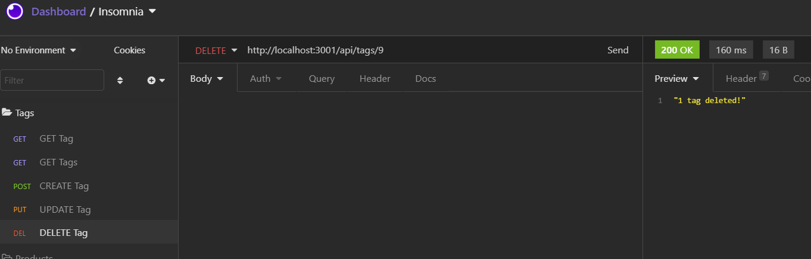
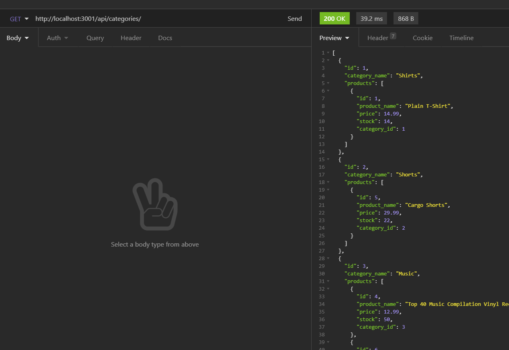

# E-Commerce-Back-End

# Description
A configured working Express.js API to use Sequelize to interact with a MySQL database. Has routes for deleting, updating, and creating products, categories and tags. Also features routes to 'GET' products, categories and tags from all of the respective tables.


## User Story

```md
AS A manager at an internet retail company
I WANT a back end for my e-commerce website that uses the latest technologies
SO THAT my company can compete with other e-commerce companies
```

## Dependencies
```md
dotenv: v8.2.0
express: v4.17.1
mysql2: v2.1.0
sequelize: v5.21.7
```
## Usage 

1) Install dependencies in terminal:
```md 
npm i
```
2) Seed tables:
```md
npm run seed 
```
3) Sync included models to the DB and turn on the server:
```md
npm run start 
```
POST:


DELETE:


GET: 
